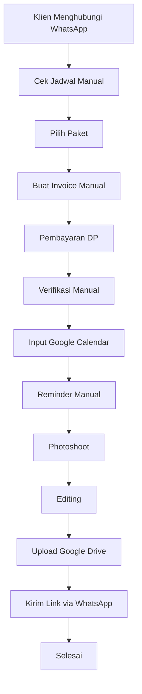

# 📸 Lovery Studio Management System

> **Document:** 02_CURRENT_WORKFLOW.md
> **Version:** 1.0.0
> **Status:** Draft MVP
> **Last Update:** 1 Juli 2026

---

# Current Workflow

## Pendahuluan

Dokumen ini menjelaskan bagaimana proses operasional Lovery Photography berjalan **sebelum** Lovery Studio Management System dibangun.

Tujuan dokumen ini bukan untuk mengkritik cara kerja yang sudah ada.

Sebaliknya, dokumen ini dibuat agar seluruh tim memahami alur bisnis yang selama ini berjalan sehingga sistem yang dibangun benar-benar mengikuti kebutuhan operasional studio.

Salah satu prinsip utama proyek ini adalah:

> **Sistem harus mengikuti cara kerja Lovery, bukan memaksa Lovery mengikuti sistem.**

---

# Gambaran Umum

Saat ini Lovery Photography menjalankan operasional menggunakan beberapa aplikasi yang saling terpisah.

Di antaranya:

- WhatsApp
- Google Calendar
- Google Drive
- Invoice Manual
- Spreadsheet
- Catatan Admin

Masing-masing aplikasi digunakan untuk kebutuhan yang berbeda.

Akibatnya, admin harus berpindah dari satu aplikasi ke aplikasi lain hanya untuk menyelesaikan satu pengajuan klien.

---

# Alur Operasional Saat Ini

## Tahap 1 — Klien Menghubungi Admin

Sebagian besar klien mengetahui Lovery Photography melalui media sosial.

Setelah melihat portfolio atau informasi paket, klien langsung menghubungi admin melalui WhatsApp.

Biasanya klien akan menanyakan:

- Apakah tanggal tertentu masih tersedia?
- Berapa harga paket?
- Apakah tersedia fotografer?
- Apakah ada biaya transport?
- Bagaimana cara melakukan booking?

Pada tahap ini seluruh komunikasi masih dilakukan secara manual.

---

## Tahap 2 — Admin Mengecek Jadwal

Setelah menerima pesan dari klien, admin harus membuka Google Calendar untuk memastikan apakah tanggal yang diminta masih tersedia.

Pengecekan dilakukan secara manual berdasarkan pengalaman dan jadwal yang sudah ada.

Apabila jadwal tersedia, proses dilanjutkan.

Apabila tidak tersedia, admin menawarkan jadwal lain kepada klien melalui WhatsApp.

---

## Tahap 3 — Klien Memilih Paket

Setelah jadwal dianggap memungkinkan, admin mengirimkan pricelist kepada klien.

Klien kemudian memilih:

- kategori layanan
- paket
- add-on (jika ada)

Seluruh proses konsultasi tetap dilakukan melalui WhatsApp.

---

## Tahap 4 — Admin Membuat Invoice

Setelah paket dipilih, admin membuat invoice secara manual.

Nilai invoice dihitung berdasarkan:

- paket utama
- add-on yang dipilih
- ketentuan DP

Invoice kemudian dikirimkan kepada klien melalui WhatsApp.

---

## Tahap 5 — Klien Membayar DP

Klien melakukan pembayaran sesuai invoice.

Pembayaran dilakukan melalui transfer bank atau QRIS.

Setelah melakukan pembayaran, klien mengirimkan bukti pembayaran melalui WhatsApp.

---

## Tahap 6 — Admin Memverifikasi DP

Admin memeriksa bukti pembayaran secara manual.

Apabila pembayaran telah sesuai, admin menganggap pengajuan telah menjadi sesi yang resmi.

Selanjutnya admin memasukkan jadwal tersebut ke Google Calendar.

---

## Tahap 7 — Menjelang Hari Pemotretan

Sebelum hari pelaksanaan, admin melakukan beberapa pekerjaan secara manual.

Di antaranya:

- mengingatkan pelunasan
- mengingatkan jadwal kepada klien
- memastikan seluruh kebutuhan sesi sudah lengkap

Seluruh komunikasi tetap dilakukan melalui WhatsApp.

---

## Tahap 8 — Hari Pelaksanaan

Pada hari pelaksanaan, admin hanya melakukan monitoring apabila diperlukan.

Setelah sesi selesai, proses dilanjutkan ke tahap editing.

---

## Tahap 9 — Editing

Setelah proses pemotretan selesai, hasil foto atau video masuk ke tahap editing.

Admin harus memastikan hasil selesai sesuai estimasi.

Belum terdapat sistem yang membantu memantau progres editing.

---

## Tahap 10 — Pengiriman Hasil

Setelah proses editing selesai:

1. Admin mengunggah hasil ke Google Drive.
2. Admin menyalin tautan Google Drive.
3. Admin mengirimkan tautan tersebut kepada klien melalui WhatsApp.

Masa aktif tautan mengikuti ketentuan paket yang dipilih oleh klien.

---

# Ringkasan Workflow Saat Ini

Secara sederhana, alur kerja Lovery Photography saat ini adalah sebagai berikut.

---

# Permasalahan Yang Muncul

Walaupun workflow di atas telah berjalan dengan baik, terdapat beberapa pekerjaan yang dilakukan berulang kali.

Contohnya:

- membuat invoice secara manual
- menghitung DP
- mencatat pembayaran
- mengingatkan pelunasan
- mengingatkan jadwal
- memasukkan jadwal ke Google Calendar
- mencatat pendapatan
- membuat laporan

Semakin banyak jumlah klien, semakin besar pula beban administrasi yang harus dikerjakan.

---

# Kesimpulan

Cara kerja Lovery Photography saat ini sebenarnya sudah efektif.

Permasalahan utama bukan terletak pada proses bisnisnya.

Permasalahan utama terletak pada banyaknya pekerjaan administratif yang masih dilakukan secara manual.

Oleh karena itu, Lovery Studio Management System tidak akan mengubah alur bisnis tersebut.

Sebaliknya, sistem akan mempertahankan workflow yang sudah ada, kemudian mengotomatisasi proses-proses yang selama ini masih dikerjakan secara manual.

Dokumen berikutnya akan membahas secara rinci setiap permasalahan yang muncul pada workflow di atas beserta alasan mengapa sistem perlu dibangun.